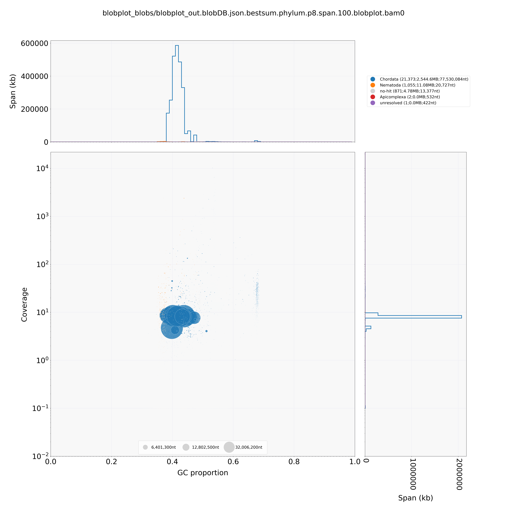
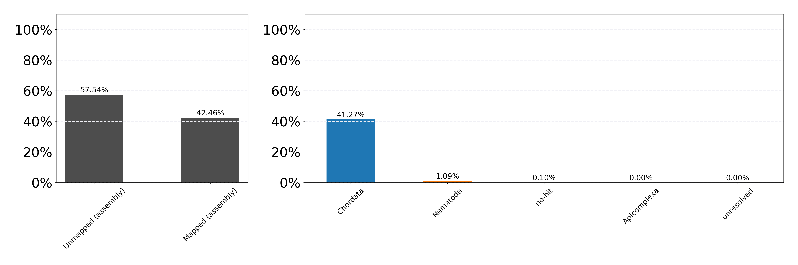

#  There appears to be some contamination in the genome assembly, run blobtools

```
#/work/GIF/remkv6/Elk/01_Blobtools


sh runMegablast.sh north_american_elk_15Jun2018_oY8t2.fasta
################################################################################
#!/bin/bash
wget ftp://ftp.ncbi.nlm.nih.gov/blast/db/taxdb.tar.gz
tar -zxvf taxdb.tar.gz

module load blast-plus
FASTA="$1"
blastn \
-task megablast \
-query ${FASTA} \
-db /work/GIF/GIF3/arnstrm/Baum/GenePrediction_Hg_20160115/05_databases/nt/nt \
-outfmt '6 qseqid staxids bitscore std sscinames sskingdoms stitle' \
-culling_limit 5 \
-num_threads 16 \
-evalue 1e-5 \
-out ${FASTA%.**}.vs.nt.cul5.1e5.megablast.out
################################################################################


#how many are not cattle related?
less north_american_elk_15Jun2018_oY8t2.vs.nt.cul5.1e5.megablast.out |sort -k1,1 -u |grep -v "Ovis canadensis" |grep -v "Bos taurus" |grep -v "Muntiacus reevesi" |grep -v "Muntiacus vaginalis" |grep -v "Ovis aries" |grep -v "Bison bison" |less

```

###  Read mapping to genome
```
/home/rick.masonbrink/elk_bison_genomics/Masonbrink/06_blobtools
for f in ../../pacbio/*bz2; do ln -s $f;done

tar xvfj 10_9649_Bull-Elk1_PacBio_1060_1.tar.bz2
tar xvfj 10_9649_Bull-Elk1_PacBio_1060.tar.bz2
tar xvfj 10_9650_Bull-Elk2_PacBio_1061_1.tar.bz2
tar xvfj 10_9650_Bull-Elk2_PacBio_1061_2.tar.bz2
tar xvfj 10_9650_Bull-Elk2_PacBio_1061.tar.bz2
tar xvfj 10_9651_Bull-Elk3_PacBio_1067.tar.bz2
tar xvfj 10_9651_Bull-Elk3_PacBio_1078.tar.bz2
tar xvfj 10_9652_Bull-Elk4_PacBio_1079.tar.bz2

mkdir 01_Reads/
mv *fastq 01_Reads/


#align reads
sh runPilon.sh AllFastq.fastq /home/rick.masonbrink/elk_bison_genomics/Masonbrink/06_blobtools north_american_elk_15Jun2018_oY8t2.fasta

################################################################################
###############################################################################
#!/bin/bash

#You must provide the following. Note variable DBDIR does not need a "/" at the end.
# sh runPilon.sh LongReads.fastq /work/GIF/remkv6/files genome.fa ShortReadsR1.fq ShortReadsR2.fq


PBReadsFq="$1"
DIR="$2"
GENOME="$3"
R1_FQ="$4"
R2_FQ="$5"

#module load hisat2
#hisat2-build ${GENOME} ${GENOME%.*}
#hisat2 -p 16 -x ${GENOME%.*} -1 $R1_FQ -2 $R2_FQ -S ${R1_FQ%.*}.sam
#module load samtools
#samtools view --threads 16 -b -o ${GENOME%.*}.${R1_FQ%.*}.bam ${GENOME%.*}.${R1_FQ%.*}.sam
#samtools sort -m 7G -o ${GENOME%.*}.${R1_FQ%.*}_sorted.bam -T Round3PilonPB_temp --threads 16 ${GENOME%.*}.${R1_FQ%.*}.bam
#samtools index ${GENOME%.*}.${R1_FQ%.*}_sorted.bam


module load minimap2
minimap2 -L -ax asm10 ${GENOME} ${PBReadsFq}  >${GENOME%.*}.${PBReadsFq%.*}.sam

module load samtools
samtools view --threads 40 -b -o ${GENOME%.*}.${PBReadsFq%.*}.bam ${GENOME%.*}.${PBReadsFq%.*}.sam
samtools sort -m 3G -o ${GENOME%.*}.${PBReadsFq%.*}_sorted.bam -T Round3PilonPB_temp --threads 16 ${GENOME%.*}.${PBReadsFq%.*}.bam
samtools index ${GENOME%.*}.${PBReadsFq%.*}_sorted.bam

################################################################################
hmmm.  only 10% of reads mapped.

#

mkdir 02_RealignMinimapPB;cd 02_RealignMinimapPB/
#same parameters as above, except

#Changed: minimap2 -L -ax asm10 ${GENOME} ${PBReadsFq}  >${GENOME%.*}.${PBReadsFq%.*}.sam
#To: minimap2 -L -ax map-pb ${GENOME} ${PBReadsFq}  >${GENOME%.*}.${PBReadsFq%.*}.sam

This resulted in 95.29% of reads mapping

```


### Blobtools on juicer genome
```

runBlobtools.sh
###############################################################################
#!/bin/bash

#module load bwa
#module load samtools
#module load blobtools

BAM=SecondRun.bam
GENOME=north_american_elk_15Jun2018_oY8t2.fasta
BLAST=AllBlasts.out


NODES=nodes.dmp
NAMES=names.dmp

/home/rick.masonbrink/elk_bison_genomics/Masonbrink/06_blobtools/blobtools/blobtools create   -i $GENOME  -b $BAM   -t $BLAST   --nodes $NODES  --names $NAMES   -o blobplot_out

mkdir -p blobplot_files

/home/rick.masonbrink/elk_bison_genomics/Masonbrink/06_blobtools/blobtools/blobtools view   -i blobplot_out.blobDB.json   -o blobplot_files/
/home/rick.masonbrink/elk_bison_genomics/Masonbrink/06_blobtools/blobtools/blobtools blobplot -i blobplot_out.blobDB.json -o blobplot_files/

grep -v '^#' blobplot_files/blobplot_out.blobDB.table.txt | cut -f 1,3 > blobDB.id.gc.txt
awk '$2 < 0.25' blobDB.id.gc.txt |   cut -f1 |   perl -lne 'print $_.",<20%"'   > blobDB.id.gc.catcolour.txt
awk '$2 >= 0.20 && $2 < 0.30' blobDB.id.gc.txt |   cut -f1 |   perl -lne 'print $_.",20-29%"'   >> blobDB.id.gc.catcolour.txt
awk '$2 >= 0.30 && $2 < 0.40' blobDB.id.gc.txt |   cut -f1 |   perl -lne 'print $_.",30-39%"'   >> blobDB.id.gc.catcolour.txt
awk '$2 >= 0.40 && $2 < 0.50' blobDB.id.gc.txt |   cut -f1 |   perl -lne 'print $_.",40-49%"'   >> blobDB.id.gc.catcolour.txt
awk '$2 >= 0.50 && $2 < 0.60' blobDB.id.gc.txt |   cut -f1 |   perl -lne 'print $_.",50-59%"'   >> blobDB.id.gc.catcolour.txt
awk '$2 >= 0.60 && $2 < 0.70' blobDB.id.gc.txt |   cut -f1 |   perl -lne 'print $_.",60-69%"'   >> blobDB.id.gc.catcolour.txt
awk '$2 >= 0.70 && $2 < 0.80' blobDB.id.gc.txt |   cut -f1 |   perl -lne 'print $_.",70-79%"'   >> blobDB.id.gc.catcolour.txt
awk '$2 >= 0.80 && $2 < 0.90' blobDB.id.gc.txt |   cut -f1 |   perl -lne 'print $_.",80-89%"'   >> blobDB.id.gc.catcolour.txt
awk '$2 >= 0.90 && $2 < 1.00' blobDB.id.gc.txt |   cut -f1 |   perl -lne 'print $_.",90-99%"'   >> blobDB.id.gc.catcolour.txt

/home/rick.masonbrink/elk_bison_genomics/Masonbrink/06_blobtools/blobtools/blobtools covplot   -i blobplot_out.blobDB.json   -c blobplot_out.SecondRun.bam.cov   --catcolour blobDB.id.gc.catcolour.txt   --notitle   --ylabel WGA-resequencing-library   --xlabel WGS-resequencing-library
mkdir -p blobplot_blobs

/home/rick.masonbrink/elk_bison_genomics/Masonbrink/06_blobtools/blobtools/blobtools plot   -i blobplot_out.blobDB.json   -o blobplot_blobs/

###############################################################################
sh runBlobtools.sh
```

### Post analysis
```
#How many scaffolds do not have any subread coverage?
less blobplot_out.FirstScaffoldsStep0.FINAL.AllFastq_sorted.bam.cov |awk '$2==0'  >ZeroCovScaffs
wc ZeroCovScaffs
 12,959

#How large are the scaffolds with zero coverage
less ZeroCovScaffs |awk '{print $1}' |while read line; do samtools faidx 01_MegaBlast/FirstScaffoldsStep0.FINAL.fasta $line; done |bioawk -c fastx '{print length($seq)}' |summary.sh
^[[C^[[CTotal:  5,984,603
Count:  12,959
Mean:   461
Median: 360
Min:    119
Max:    8,167
```





