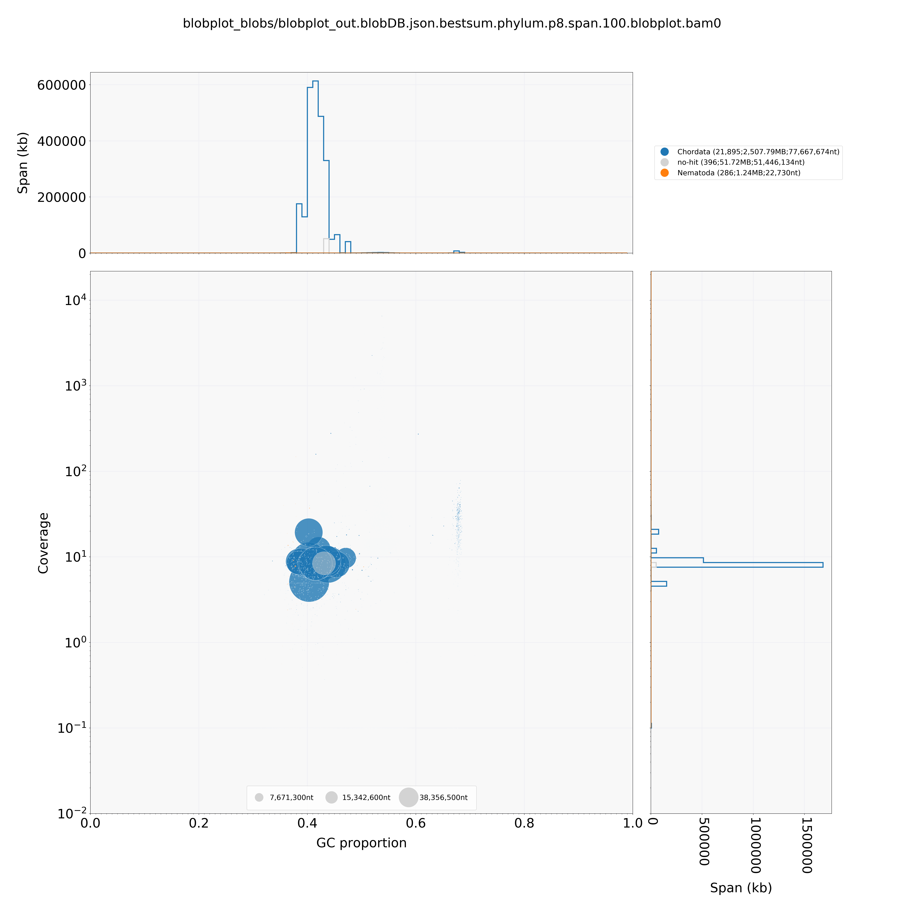
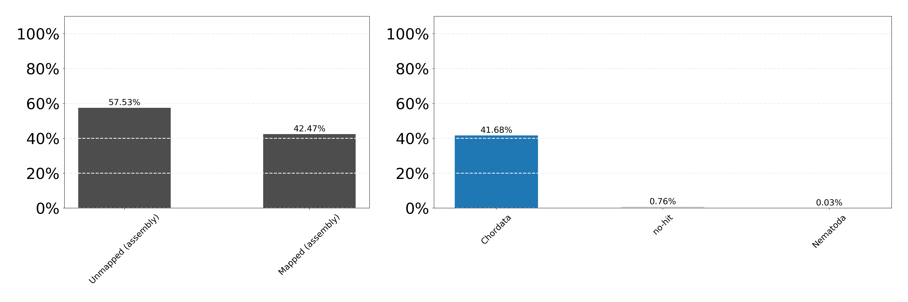

#  Re-run blobtools to determine how many scaffolds remain that could be contaminated


### directory setup
```
#/home/rick.masonbrink/elk_bison_genomics/Masonbrink/07_blobtools2juiced

ln -s ../04_JuicerElk/01_3DNA/3d-dna/01_PostJBAssembly/FinalAssembly/3d-dna/FirstScaffoldsStep0.FINAL.fasta
ln -s ../06_blobtools/AllFastq.fastq
cp ../06_blobtools/runPilon.sh
mkdir TEMP
```

### Align pacbio subreads to genome
```

sh runPilonSpecific.sh AllFastq.fastq /home/rick.masonbrink/elk_bison_genomics/Masonbrink/07_blobtools2juiced FirstScaffoldsStep0.FINAL.fasta

#had an issue with the naming, so just inserted the bam name into the script and renamed
#runPilonSpecific.sh
###############################################################################
#!/bin/bash

#You must provide the following. Note variable DBDIR does not need a "/" at the end.
# sh runPilon.sh LongReads.fastq /work/GIF/remkv6/files genome.fa ShortReadsR1.fq ShortReadsR2.fq


PBReadsFq="$1"
DIR="$2"
GENOME="$3"
R1_FQ="$4"
R2_FQ="$5"

#module load hisat2
#hisat2-build ${GENOME} ${GENOME%.*}
#hisat2 -p 16 -x ${GENOME%.*} -1 $R1_FQ -2 $R2_FQ -S ${R1_FQ%.*}.sam
#module load samtools
#samtools view --threads 16 -b -o ${GENOME%.*}.${R1_FQ%.*}.bam ${GENOME%.*}.${R1_FQ%.*}.sam
#samtools sort -m 7G -o ${GENOME%.*}.${R1_FQ%.*}_sorted.bam -T Round3PilonPB_temp --threads 16 ${GENOME%.*}.${R1_FQ%.*}.bam
#samtools index ${GENOME%.*}.${R1_FQ%.*}_sorted.bam


module load minimap2
minimap2 -L -ax map-pb ${GENOME} ${PBReadsFq}  >${GENOME%.*}.${PBReadsFq%.*}.sam

module load samtools
samtools view --threads 40 -b -o ${GENOME%.*}.${PBReadsFq%.*}.bam ${GENOME%.*}.${PBReadsFq%.*}.sam
samtools sort -m 3G -o ${GENOME%.*}.${PBReadsFq%.*}_sorted.bam -T Round3PilonPB_temp --threads 16 ${GENOME%.*}.${PBReadsFq%.*}.bam
samtools index ${GENOME%.*}.${PBReadsFq%.*}_sorted.bam

module load pilon
#java -Xmx800g -Djava.io.tmpdir=/home/rick.masonbrink/elk_bison_genomics/Masonbrink/07_blobtools2juiced/TEMP -jar /software/7/apps/pilon/1.23/pilon-1.23.jar --genome ${GENOME} --unpaired FirstScaffoldsStep0.FINAL.AllFastq_sorted.bam --output ${GENOME%.*}.Pilon --outdir ${DIR} --changes --fix all --threads 40 --mingap 0 --chunksize 100000
################################################################################
#Could not run pilon with subreads, need error corrected reads
#95.29% mapping subreads, ~3k lower than previous assembly
```

### Run the Blast to nr # nr from late 2016, missing some cervus species genomes.
```
mkdir 01_MegaBlast;cd 01_MegaBlast

ln -s ../FirstScaffoldsStep0.FINAL.fasta

fasta-splitter.pl --n-parts 8 FirstScaffoldsStep0.FINAL.fasta
for f in FirstScaffoldsStep0.FINALSPLIT*.fasta; do echo "sh run_MegaBlast.sh  "$f;done >blast.sh

runMegablast.sh
################################################################################
#!/bin/bash
#wget ftp://ftp.ncbi.nlm.nih.gov/blast/db/taxdb.tar.gz
#tar -zxvf taxdb.tar.gz

module load blast+
FASTA="$1"
blastn \
-task megablast \
-query ${FASTA} \
-db /home/rick.masonbrink/elk_bison_genomics/Masonbrink/06_blobtools/NT_DB/nt \
-outfmt '6 qseqid staxids bitscore std sscinames sskingdoms stitle' \
-culling_limit 5 \
-num_threads 40 \
-evalue 1e-5 \
-out ${FASTA%.**}.vs.nt.cul5.1e5.megablast.out
################################################################################

cat *megablast.out >AllBlasts.out
```

### run Blobtools on juicer assembly
```

#!/bin/bash

#module load bwa
#module load samtools
#module load blobtools

BAM=FirstScaffoldsStep0.FINAL.AllFastq_sorted.bam
GENOME=FirstScaffoldsStep0.FINAL.fasta
BLAST=AllBlasts.out


NODES=nodes.dmp
NAMES=names.dmp

/home/rick.masonbrink/elk_bison_genomics/Masonbrink/06_blobtools/blobtools/blobtools create   -i $GENOME  -b $BAM   -t $BLAST   --nodes $NODES  --names $NAMES   -o blobplot_out

mkdir -p blobplot_files

/home/rick.masonbrink/elk_bison_genomics/Masonbrink/06_blobtools/blobtools/blobtools view   -i blobplot_out.blobDB.json   -o blobplot_files/
/home/rick.masonbrink/elk_bison_genomics/Masonbrink/06_blobtools/blobtools/blobtools blobplot -i blobplot_out.blobDB.json -o blobplot_files/

grep -v '^#' blobplot_files/blobplot_out.blobDB.table.txt | cut -f 1,3 > blobDB.id.gc.txt
awk '$2 < 0.25' blobDB.id.gc.txt |   cut -f1 |   perl -lne 'print $_.",<20%"'   > blobDB.id.gc.catcolour.txt
awk '$2 >= 0.20 && $2 < 0.30' blobDB.id.gc.txt |   cut -f1 |   perl -lne 'print $_.",20-29%"'   >> blobDB.id.gc.catcolour.txt
awk '$2 >= 0.30 && $2 < 0.40' blobDB.id.gc.txt |   cut -f1 |   perl -lne 'print $_.",30-39%"'   >> blobDB.id.gc.catcolour.txt
awk '$2 >= 0.40 && $2 < 0.50' blobDB.id.gc.txt |   cut -f1 |   perl -lne 'print $_.",40-49%"'   >> blobDB.id.gc.catcolour.txt
awk '$2 >= 0.50 && $2 < 0.60' blobDB.id.gc.txt |   cut -f1 |   perl -lne 'print $_.",50-59%"'   >> blobDB.id.gc.catcolour.txt
awk '$2 >= 0.60 && $2 < 0.70' blobDB.id.gc.txt |   cut -f1 |   perl -lne 'print $_.",60-69%"'   >> blobDB.id.gc.catcolour.txt
awk '$2 >= 0.70 && $2 < 0.80' blobDB.id.gc.txt |   cut -f1 |   perl -lne 'print $_.",70-79%"'   >> blobDB.id.gc.catcolour.txt
awk '$2 >= 0.80 && $2 < 0.90' blobDB.id.gc.txt |   cut -f1 |   perl -lne 'print $_.",80-89%"'   >> blobDB.id.gc.catcolour.txt
awk '$2 >= 0.90 && $2 < 1.00' blobDB.id.gc.txt |   cut -f1 |   perl -lne 'print $_.",90-99%"'   >> blobDB.id.gc.catcolour.txt

/home/rick.masonbrink/elk_bison_genomics/Masonbrink/06_blobtools/blobtools/blobtools covplot   -i blobplot_out.blobDB.json   -c blobplot_out.FirstScaffoldsStep0.FINAL.AllFastq_sorted.bam.cov   --catcolour blobDB.id.gc.catcolour.txt   --notitle   --ylabel WGA-resequencing-library   --xlabel WGS-resequencing-library
mkdir -p blobplot_blobs

/home/rick.masonbrink/elk_bison_genomics/Masonbrink/06_blobtools/blobtools/blobtools plot   -i blobplot_out.blobDB.json   -o blobplot_blobs/
```




### Post analysis
```
#How many scaffolds do not have any subread coverage?
less blobplot_out.FirstScaffoldsStep0.FINAL.AllFastq_sorted.bam.cov |awk '$2==0'  >ZeroCovScaffs
wc ZeroCovScaffs
 12,959

#How large are the scaffolds with zero coverage
less ZeroCovScaffs |awk '{print $1}' |while read line; do samtools faidx 01_MegaBlast/FirstScaffoldsStep0.FINAL.fasta $line; done |bioawk -c fastx '{print length($seq)}' |summary.sh
^[[C^[[CTotal:  5,984,603
Count:  12,959
Mean:   461
Median: 360
Min:    119
Max:    8,167

#are those nematoda contigs really contamination?
less blobplot_out.blobDB.table.txt |awk '$6=="Nematoda"' |wc
   286    2288   15739

less blobplot_files/blobplot_out.blobDB.table.txt |awk '$6=="Nematoda"' |awk '{print $1}' |while read line; do samtools faidx FirstScaffoldsStep0.FINAL.fasta $line; done >NematodaScaffs.fasta

#How many have other blast hits that are more appropriate
less NematodaScaffs.blastout |grep -v "Onchocerca" |sort -k1,1V -k3,3n |awk '{print $1}' |sort|uniq|wc
    10      10     172

#how many scaffold regions of Onchocerca flexuosa do the elk scaffolds map to
less NematodaScaffs.blastout |grep  "Onchocerca" |sort -k1,1V -k3,3n |sort -u -k1,1|awk '{print $12,$13,$22$24}' |awk '{if($1>$2){print $3,$2,$1}else {print $3,$1,$2}}' |sort -k1,1V -k2,2n |tr " " "\t" |bedtools merge  -d 1000 |wc
     76     228    3370


#how many are low complexity repeats?
module load trf
trf NematodaScaffs.fasta 2 7 7 80 10 50 500 -ngs >trfNematoda.out &

#how to get 1 scaffold, scaffold length
paste <(grep "Sequence:" NematodaScaffs.fasta.s95.2.7.7.80.10.50.500.1.txt.html) <(less NematodaScaffs.fasta.s95.2.7.7.80.10.50.500.1.txt.html |grep "Indic" |awk 'NR==1' |less) <(less NematodaScaffs.fasta.s95.2.7.7.80.10.50.500.1.txt.html |grep "Length" )|less

for f in *html; do echo "paste <(grep \"Sequence:\" "$f") <(less "$f" |grep \"Indic\" |awk 'NR==1' |less) <(less "$f" |grep \"Length\" ) > "${f%.*}"trfCondense.out";done >condense.sh

sh condense.sh

#how many are 90% of their length, a simple tandem repeat sequence
cat *Condense.out |sed 's/--/ /g' |awk '$5>($9*.9){print $2}' |wc
   246     246    4495


#So how many are not really Nematoda?
cat trf_html/*ndense.out |sed 's/--/ /g' |awk '$5>($9*.9){print $2}' |cat - <(less NematodaScaffs.blastout |grep -v "Onchocerca" |sort -k1,1V -k3,3n |awk '{print $1}' |sort|uniq|less) |sort|uniq|wc
259     259    4724

#quick look at the remaining fastas
cat trf_html/*ndense.out |sed 's/--/ /g' |awk '$5>($9*.9){print $2}' |cat - <(less NematodaScaffs.blastout |grep -v "Onchocerca" |sort -k1,1V -k3,3n |awk '{print $1}' |sort|uniq|less) |sort|uniq|grep -v -f - NematodaScaffs.blastout |awk '{print $1}' |sort|uniq|while read line; do samtools faidx FirstScaffoldsStep0.FINAL.fasta $line; done |less
#these still look like low complexity repeats
Manually inspected last 27 sequences, all are simple repeats.
```
