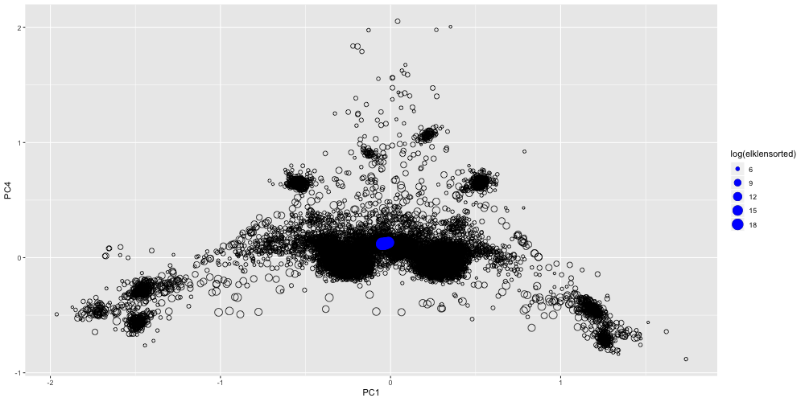
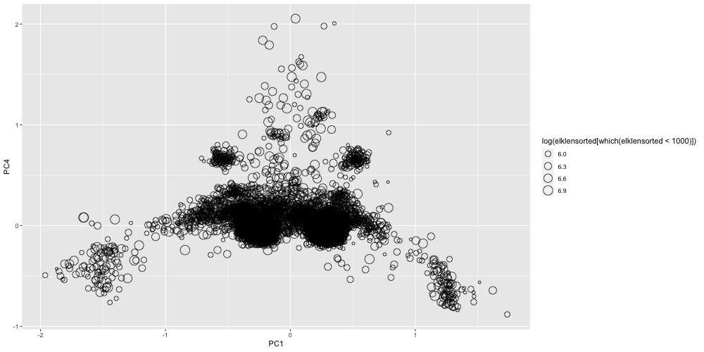
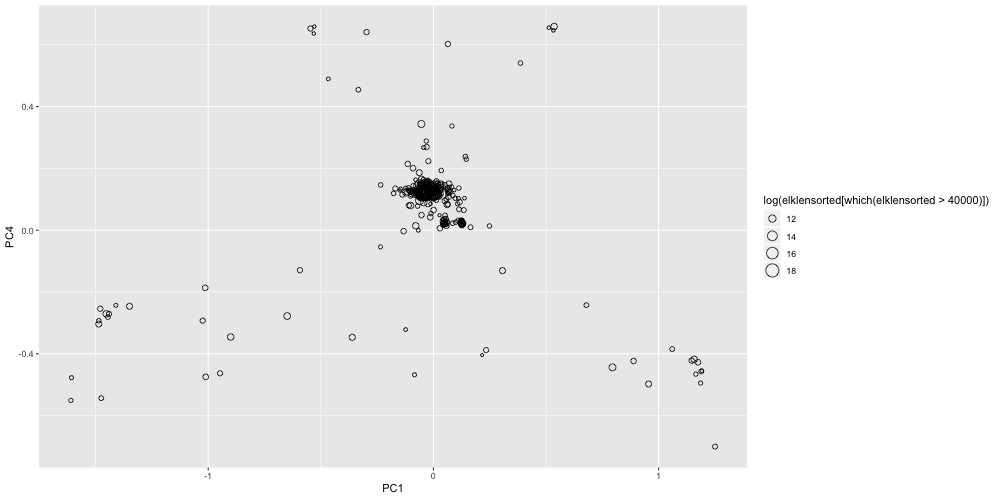
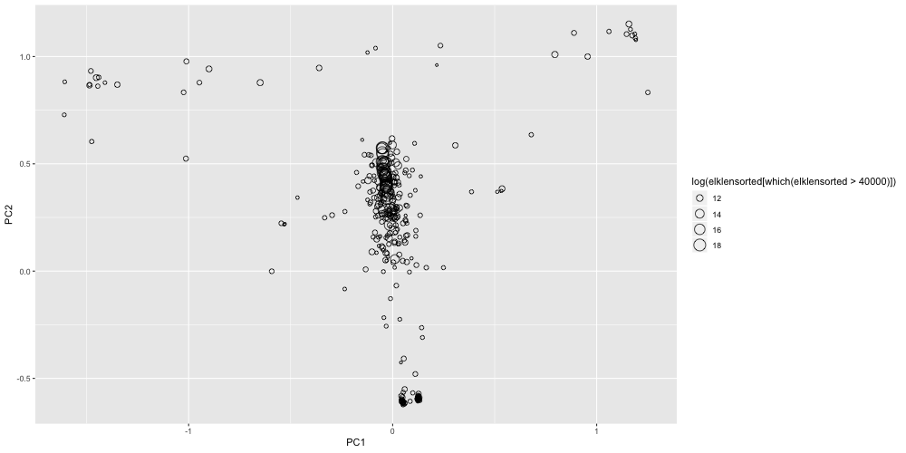

# Kmer Matrix

One way to look for contamination is to look at the frequency of 3-mers in each scaffold and look for scaffolds that cluster differently from the rest.  This is a function I requested of the jellyfish author but have yet to find a good place for publishing it. The program can be found in the scripts folder in this repo.


## Create a softlink to the mer_matrix program
```
ln -s ~/isugif/privateGIF/mer_matrix-0.0.1/bin/mer_matrix
```

## Run Mer matrix to create a 64 column matrix of 3mers

```
module load jellyfish2/2.2.9
#was getting an error that it couldn't find libjellyfish-2.0.so.2 so I added it to the LD_LIBRARY_PATH variable
export LD_LIBRARY_PATH="$LD_LIBRARY_PATH:/software/7/apps/jellyfish2/2.2.9/lib/"
./mer_matrix ../00_rawdata/north_american_elk_15Jun2018_oY8t2.fasta >elk.3mer

```


## Explore output in R

Transferred the output to my laptop

* /Users/severin/isugif/03_merMatrix

#### Load the 3mer data and calculate PCA of vectors
```
elkmer<-read.table('elk.3mer')
rownames(elkmer)<-elkmer[,1]
elkmer<-elkmer[,2:dim(elkmer)[2]]
elkmer.rs<-rowSums(elkmer)
elkmer.norm<-10*sweep(elkmer,1,elkmer.rs,FUN="/")

elkpca<-prcomp((elkmer.norm))

```

#### Load length data for plotting size info by circle circumference

```
elklen<-read.table('north_american_elk_15Jun2018_oY8t2.len')

```


```
library(ggplot2)

# Here I am creating a new x11 window then plotting the elkpca x values for PC1 and PC6 then changing the point size from 2 to the log of the scaffold size with an open circle shape.  I had to sort the elklen in the same order as the elkpca data as well.
x11()
ggplot(as.data.frame(elkpca$x), aes(PC1, PC4),size=2)+ geom_point(aes(size = log(elklen[rownames(elkpca$x),])),shape=1) + geom_point(aes(size = log(elklen[rownames(elkpca$x),])),shape=1)


# simplify the code by making new variables for the sorted length and dataframe
elklensorted<-elklen[rownames(elkpca$x),]
elkpcaDF<-as.data.frame(elkpca$x)

# Here I added a new geom_point to color the largest scaffolds > 10Mb
x11()
ggplot(elkpcaDF, aes(PC1, PC4),size=2)+ geom_point(aes(size = log(elklensorted)),shape=1) + geom_point(data=elkpcaDF[which(elklensorted>10000000),],aes(size= log(elklensorted[which(elklensorted>10000000)])),color='blue')

# Save plot to file
png(file="kmerplot_pc1-pc4.png",width=1000,height=500)
ggplot(elkpcaDF, aes(PC1, PC4),size=2)+ geom_point(aes(size = log(elklensorted)),shape=1) + geom_point(data=elkpcaDF[which(elklensorted>10000000),],aes(size= log(elklensorted[which(elklensorted>10000000)])),color='blue')
dev.off()
```

This plot shows that the bulk of the assembly is right in the center of the plot.  




## New plot of only scaffolds with specific lengths

Want to explore potential artifacts that can arise with short scaffolds.  The best confidence for this method are with larger scaffolds >10k or even 40k


#### scaffolds < 1000
```
png(file="kmerplot_pc1-pc4LT1000.png",width=1000,height=500)
ggplot(elkpcaDF[which(elklensorted<1000),], aes(PC1, PC4),size=2)+ geom_point(aes(size = log(elklensorted[which(elklensorted<1000)])),shape=1)
dev.off()
```


From the above plot it is pretty clear that the bulk of the other clusters of scaffolds are due to an artifact of clustering due to the small size of the scaffolds.

#### scaffolds > 40000 PC1 PC4

Looking at the same plot again but subtracting out all scaffolds less than 40,000 bases in length we get the following plot.
```
png(file="kmerplot_pc1-pc4GTR40000.png",width=1000,height=500)
ggplot(elkpcaDF[which(elklensorted>40000),], aes(PC1, PC4),size=2)+ geom_point(aes(size = log(elklensorted[which(elklensorted>40000)])),shape=1)
dev.off()
```


There is still some spread of the data and some scaffolds that may be questionable to be included in the assembly as contamination as they are very far from the known chromosome cluster.  Especially the two to the lower right.  

#### scaffolds > 40000 PC1 PC2 for better separation

Now that most of the artifacts are gone let's replot with the higher separation of PC1 and PC2

```
png(file="kmerplot_pc1-pc2GTR40000.png",width=1000,height=500)
ggplot(elkpcaDF[which(elklensorted>40000),], aes(PC1, PC2),size=2)+ geom_point(aes(size = log(elklensorted[which(elklensorted>40000)])),shape=1)
dev.off()
```


Now we can clearly see the very large scaffolds in the main cluster in the center and two strong clusters near the bottom and perhaps top left right that should be futher investigated as contamination. It is possible the two clusters at the bottom are mitochondrial genome or multiple copies of the mitochondrial genome.

```
> elkpcaDF[559,1:2]
                              PC1       PC2
ScoY8t2_559;HRSCAF=649 0.04722946 -0.610431
```

I will correlate these findings with that of blobtools to make a decision as to which contigs to keep.  Though I will likely wait to see if Rick can do his magic and pull some more of the contigs together.
